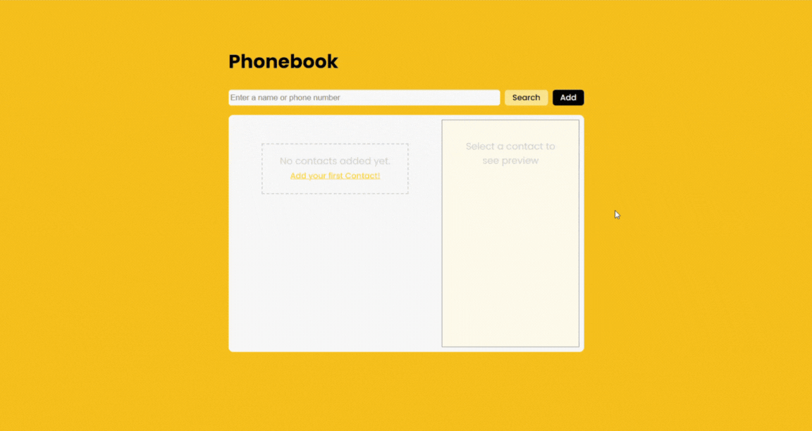

# Phonebook

## Table of contents

- [About](#about)
  - [Links](#links)
  - [Screenshots](#screenshots)
  - [Overview](#overview)
  - [Built with](#built-with)
- [Author](#author)
- [Acknowledgments](#acknowledgments)

## About

### Links

Live Site: [https://sruthi-nair166.github.io/phonebook/](https://sruthi-nair166.github.io/phonebook/)

### Screenshots

### Overview

This project is a responsive Phonebook web application that allows users to create, search, view, edit, and delete contacts. The interface adapts to different screen sizes, showing a split-list and preview layout on desktop and a modal-based contact preview on mobile devices for showing detailed contact information

Users can add new contacts using a modal form and search contacts by name or phone number. Selecting a contact opens a popup modal with options to edit or delete the contact. The app also handles empty states clearly, showing appropriate messages when no contacts exist or when search results return no matches.

The application is connected to a mock REST API to persist contact data, supporting full CRUD operations.

### Built With

- Semantic HTML5 markup
- CSS custom properties
- Flexbox and Grid
- Vanilla JavaScript (DOM manipulation, event handling, responsive logic)
- REST API integration (GET, POST, PUT, DELETE)

## Author

- LinkedIn - [Sruthi V Nair](https://www.linkedin.com/in/sruthi-v-nair-5b5a09191/)
- Github - [Sruthi V Nair](https://github.com/sruthi-nair166)

## Acknowledgments

This project was built as part of an assignment in the Full Stack Development course I'm currently enrolled in, offered by Entri Elevate. Special thanks to the course instructors and materials for the guidance and support.
